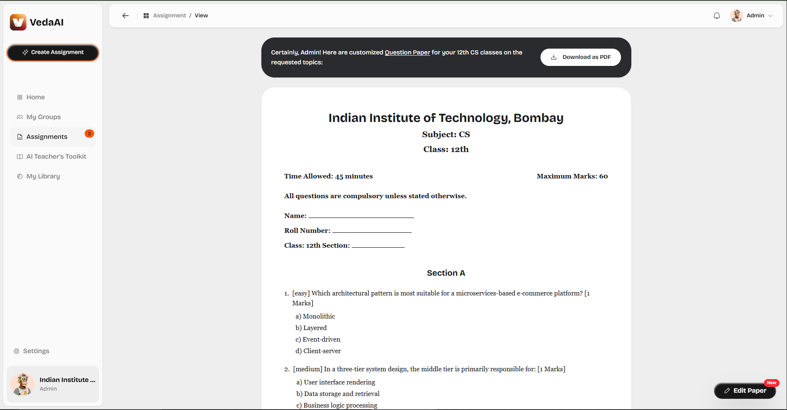
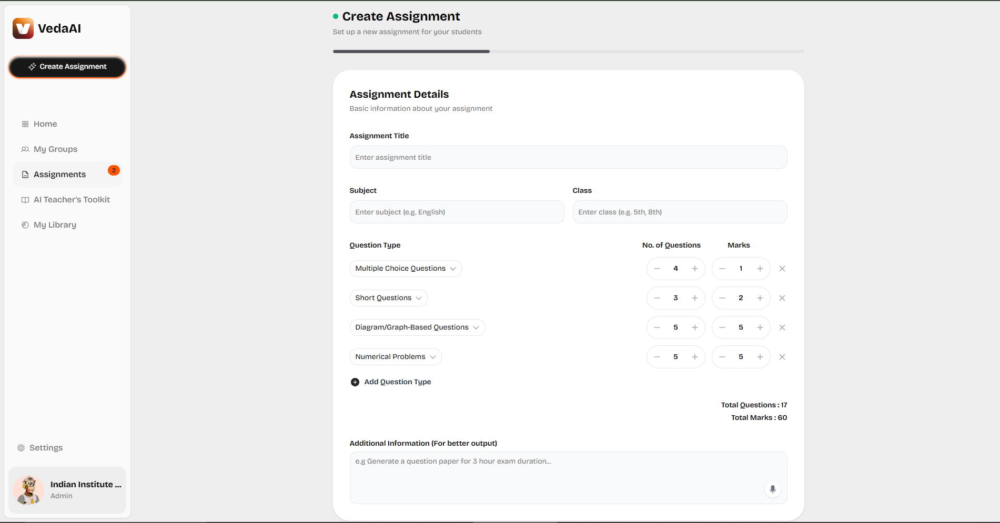
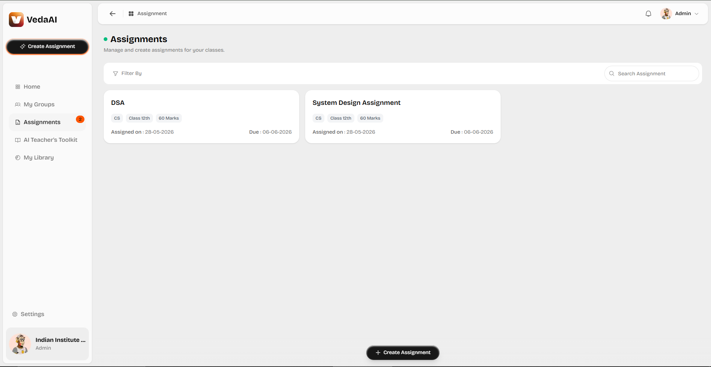
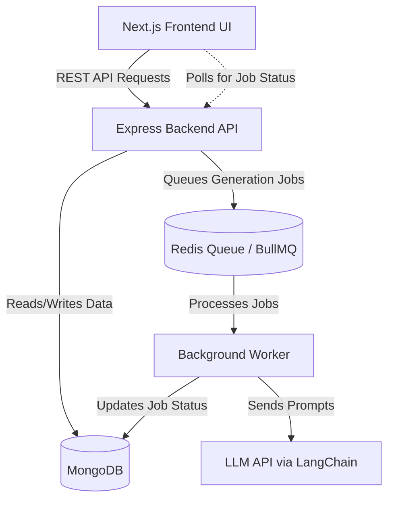

# VedaAI

VedaAI is an AI-powered academic system designed for seamless assessment generation, teaching assistance, and personalized learning. This platform empowers educators to rapidly generate, edit, and manage customized question papers and assignments tailored to specific classes, subjects, and difficulty levels.





## Features

- **AI-Powered Assignment Generation**: Generate complete question papers based on subject, class, and custom requirements (e.g., Multiple Choice, Short Questions, Numerical Problems).
- **Interactive Editing**: Directly edit generated questions, add feedback for regeneration, and fine-tune individual components.
- **Regeneration**: Use AI to quickly regenerate a new paper based on specific feedback or an updated configuration.
- **Rate Limiting**: Built-in protection for AI generation endpoints to prevent abuse (e.g., limited to 5 requests per 15 minutes).
- **Responsive & Modern UI**: Built with a sleek, animated interface using Framer Motion and Shadcn.
- **Print Ready**: Easily print or download assignments directly as PDFs with optimized print layouts.
- **Job Queuing**: Robust background processing using BullMQ and Redis for heavy AI generation tasks.

## Tech Stack

### Frontend

- **Framework**: [Next.js](https://nextjs.org/) (React 19)
- **Styling**: [Tailwind CSS v4](https://tailwindcss.com/) & [Shadcn UI](https://ui.shadcn.com/)
- **Animations**: [Framer Motion](https://www.framer.com/motion/)
- **State Management**: [Redux Toolkit](https://redux-toolkit.js.org/)
- **Icons**: [Phosphor Icons](https://phosphoricons.com/)

### Backend

- **Framework**: [Node.js](https://nodejs.org/) & [Express](https://expressjs.com/)
- **Language**: [TypeScript](https://www.typescriptlang.org/)
- **AI / LLM Integration**: [Langchain](https://js.langchain.com/)
- **Queue System**: [BullMQ](https://docs.bullmq.io/) & [Redis](https://redis.io/)
- **Database**: [MongoDB](https://www.mongodb.com/) (Mongoose)
- **Security**: Express Rate Limit, JWT Authentication, bcryptjs

## Architecture Overview

VedaAI follows a modern, scalable client-server architecture with asynchronous background processing for AI tasks:



1. **Client Layer (Frontend)**: A Next.js (React) application that provides an interactive UI for teachers. State is managed via Redux Toolkit.
2. **API Layer (Backend)**: An Express.js REST API that handles authentication, business logic, and CRUD operations for assignments.
3. **Asynchronous Worker Layer**: Because AI text generation can be slow, VedaAI uses **BullMQ** and **Redis** to offload generation requests to background workers. The frontend receives a `jobId` and polls the status until completion.
4. **AI/LLM Integration Layer**: The backend uses **LangChain** to construct robust prompts and communicate with large language models (like Gemini or local Ollama models) to generate structured educational content.
5. **Data Layer**: A **MongoDB** database stores the generated assignments, teacher accounts, and job statuses.

## Approach

- **Non-blocking UX**: By utilizing a job queue (BullMQ), the system ensures that long-running AI requests don't block the API or time out the client. The UI displays skeleton loaders and polls for completion.
- **Structured AI Outputs**: LangChain is used to enforce strict output schemas from the LLM, ensuring the generated question papers always follow a predictable format (Sections, Questions, Options, Marks, Answer Keys) that can be easily parsed and rendered by the frontend.
- **Iterative Refinement**: The application provides an "Edit Paper" flow where users can provide specific text feedback on individual questions. The backend processes this feedback and regenerates only the required parts or the whole paper, maintaining context.

## Project Structure

The repository is organized into a monorepo-style structure:

- `/frontend` - Contains the Next.js application, UI components, and state management.
- `/backend` - Contains the Express server, AI generation logic, queue workers, and API routes.

## Getting Started

### Prerequisites

- Node.js (v18+)
- Redis (Required for BullMQ job processing)
- MongoDB (Local or Atlas)
- Environment Variables (e.g., API keys for Langchain/LLMs)

### Backend Setup

1. Navigate to the backend directory:
   ```bash
   cd backend
   ```
2. Install dependencies:
   ```bash
   npm install
   ```
3. Set up your `.env` file based on the required environment variables (Database URI, Redis URL, JWT Secret, LLM API Keys).
4. Start the development server:
   ```bash
   npm run dev
   ```

### Frontend Setup

1. Navigate to the frontend directory:
   ```bash
   cd frontend
   ```
2. Install dependencies:
   ```bash
   npm install
   ```
3. Start the Next.js development server:
   ```bash
   npm run dev
   ```
   _The frontend runs on port `5555` by default._

## Usage

1. **Login**: Access the teacher portal via the login page (demo credentials provided in the UI).
2. **Dashboard/Assignments**: View the list of all created assignments.
3. **Create Assignment**: Navigate to `Create Assignment`, fill in the details (Title, Subject, Class, Question Types), and submit.
4. **View & Edit**: Open an assignment to view it. Use the floating `Edit Paper` button to add feedback to specific questions or click `Regenerate Paper` to get a fresh version.
5. **Print**: Use the `Download as PDF` / Print functionality for an optimized physical copy.
